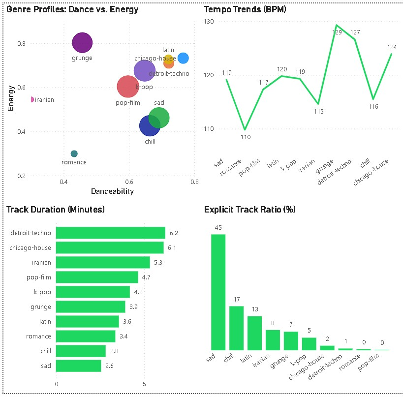

# Spotify-Audio-Analytics

## The Key Question
What specific sonic profiles (danceability, energy, tempo, length) and content attributes separate mainstream hit genres from niche genres?

## Dashboard Preview

## Key Findings
### 1. Do mainstream hit genres require high energy and loud volumes to dominate the platform?
**The Answer:** No, the data reveals an interesting paradox. While the most popular genres (`chill`, `sad`) require high danceability, they actually favor **lower energy** and quieter, more compressed volume levels. In contrast, high-energy electronic club music struggles to capture mainstream popularity scores on the platform.

### 2. Is there a specific Tempo (speed) "sweet spot" for popular music genres?
**The Answer:** Yes. The data shows that top-performing mainstream genres mostly have a steady, mid-tempo groove. Also, popularity drops off significantly when a genre's average speed becomes too fast or chaotic.

### 3. Does the physical Length (Duration) of a song impact its mainstream adoption?
**The Answer:** Yes. Mainstream genres strictly follow a standard radio-friendly format, averaging **3 to 4 minutes** per track. Niche or less popular genres show a wider variance, often featuring tracks that are either too short or too long for casual playlist streaming.

## Tools Used
* **SQL**: For data extraction, cleaning and metric aggregation.
* **Power BI**: For building the final visual dashboard overview.

## Data Source & References
* **Dataset Source:** [Kaggle - Spotify Tracks Dataset by yashdev01]([https://kaggle.com](https://www.kaggle.com/datasets/yashdev01/spotify-tracks-dataset))
* **Project Documentation:** The cleaning steps are documented in `data_cleaning.sql`, and analysis  logic is saved in `music_analysis.sql`.
